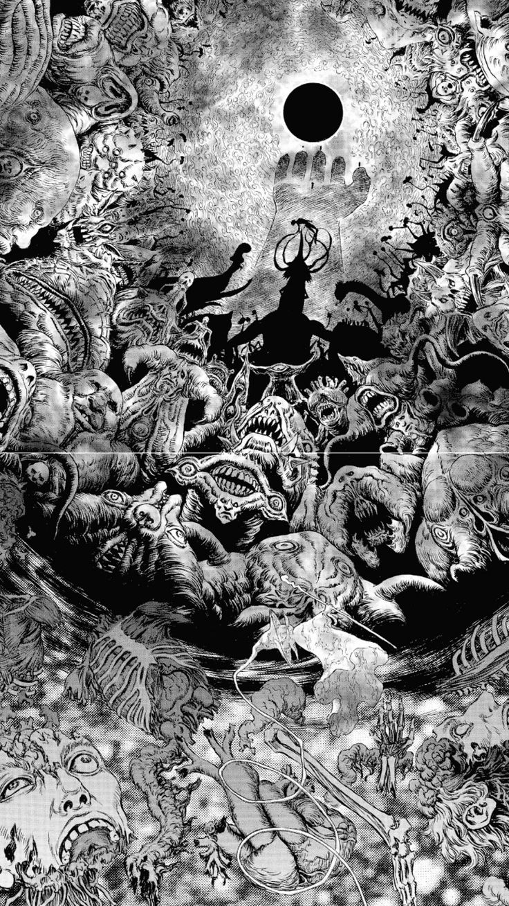

*This project is dedicated to the soul of my beloved sister, who passed away during the time I was working on this project. Her memory and love continue to inspire me every day. This code carries a piece of my heart, written in her honor. May she rest in peace. 🌸*

---

<div align="center">
  
</div>

---

<div align="center">
  
  
  
</div>

---

<table>
<tr>
<td width="40%">

Oh .. Hello there .. meow ฅ^•ﻌ•^ฅ

Well this is push swap project of the 42 school .. just sorting some numbers on something called stack .. nothing wow at this point~

It's just a simple algorithm project where we take numbers and make them go *brrrrrrrr* in the right order!

</td>
<td width="10%">
  
</td>
</tr>
</table>

---

<table>
<tr>
<td width="10%">
  
</td>
<td width="40%">

But don't worry.. we will do it in a fun way using the UwU power! ✨

First of all start it with this video, just click on the thumbnail ૮ ˶ᵔ ᵕ ᵔ˶ ა
</td>
</tr>
</table>

<div align="center">
  <a href="https://www.youtube.com/watch?v=MCkG9_XMY0M">
    
  </a>
</div>

<div align="center">
  
  [▶️ UwU Push Swap Video !▶️](https://www.youtube.com/watch?v=MCkG9_XMY0M)
</div>

---

<table>
<tr>
<td width="10%">
  
</td>
<td width="40%">

You can also have fun with my UwU tester ₍^. .^₎⟆ only by cloning my repo to your computer.

If you want a standard boring main, just replace `UwU.c` with `main.c` in the push_swap source files in the `Makefile`

</td>
</tr>
</table>
<table>
<tr>
<td width="20%">

You can still get less than 4500 operations for 500 numbers if you get rid of all optimize files beside `optimize_sort_three.c` but there will be no fun .. 
<div align="center">
  So Dame (ダメ) ❌ !
</div>
</td>
<td width="5%">
  
</td>
</tr>
</table>
<div align="center">


# **BUT NOW ... ☠️** 

  ⟆  
  
  ⟆
  
  ⟆
  
  ⟆
  
  ⟆
  
  ⟆
  
  ⟆
  
  ⟆ 
  
  ⟆
  
  ⟆
  
  ⟆
  
  ⟆
  
  ⟆
  
  ⟆ 
  
  ⟆ 
  
  ⟆
  
  ⟆
  
  ⟆
  
  ⟆
  
  ⟆
  
  ⟆
  
  ⟆
  
  ⟆
  
  ⟆   

<div align="center">
  
</div>

⟆

⟆

⟆

⟆
  
⟆
  
⟆
  
⟆
  
⟆   

 💀 **WELCOME TO HELL** 💀

  ⟆
  
  ⟆
  
  ⟆
  
  ⟆  


## 📋 **DOCUMENTATION MAP KEY**

<td width="40%">
  
</td>
<td width="60%">
</div>


<table>
<tr>
<td width="40%">
  
```
/*********************************************
*         explanation of the file            *
**********************************************/

/*ft_function_name (type of the function) here what the function does */

//--------- Params of the function : --------------------------

- param -> (type of the param) here what the param used for

//----- Context & Purpose : ---------------------------

- giving the context and the purpose of the function

//--------- variables inside the function : --------------------------

- variable -> (type of the variable) here what does the variable used for

//--------- Setup to follow for implementation : --------------------------

- implementation detailed step by step with examples 
```

</td>
<td width="40%">
  
 **In each file**
 
 **you will find commented documentation/pseudo code ..** 
 
 **this is the map key to understand what I have written**

</td>
</tr>
</table>


<div align="center">

**Read carefully. Your survival depends on it.**


---

<table>
<tr>
<td width="60%">

##  **THE WARRIOR'S PATH**

The purpose of this documentation is to guide you. This journey will not be easy, warrior. You chose a tough path...

You see that hill of swords? Each blade represents a challenge you must overcome. The path is treacherous, soaked in the blood of those who came before you. But you... you have the chance to make it through.

**The question is: Do you have what it takes?**

</td>
<td width="40%">
  
</td>
</tr>
</table>

---

<table>
<tr>
<td width="60%">

You should absorb a lot of knowledge, understand a lot of concepts and learn a lot of algorithms. Get rid of a lot of memory leaks, face segfaults, battle linked list bugs, and realize that optimize files will not work as you expect.

**You must go through hell and come back alive.**

Trust me .. the demons will test your sanity. Those double linked list will drain your soul. But if you persist... if you endure... you might just survive this.

*Many have tried. Few have succeeded.*

</td>
<td width="40%">
  
</td>
</tr>
</table>

---

<div align="center">

## **⬇ ⬇ ⬇ ⬇ MEDIUM ARTICLE ⬇ ⬇ ⬇ ⬇**

For that, you will find a Medium article that will help you in your path, facing all the obstacles on your way to conquer this project.
 
  [📖 Medium article 📖](https://medium.com/@tajdine.zouhair/mastering-push-swap-the-path-to-sorting-500-numbers-in-under-3-850-moves-977a8292aebb)

*The answers you seek lie within the forbidden texts...*

</div>

---

<table>
<tr>
<td width="60%">

The enemy is ahead.. bring the sword .. and get ready to face...

**DEATH** ☠️

*This is where legends are born and mortals fall. Choose your destiny wisely.*

</td>
<td width="40%">
  
</td>
</tr>
</table>

---

<div align="center">

#  **THE END** 
That's all .. I hope this repo was useful for you .. if so leave that star 🌟 .. I will appreciate it! 
<div align="center">
 
<div align="center">


**May the stacks be ever in your favor.** 🎭

</div>

---
*Made with a lot of ☕ by a 42 student who survived the Push Swap nightmare*

</div>
